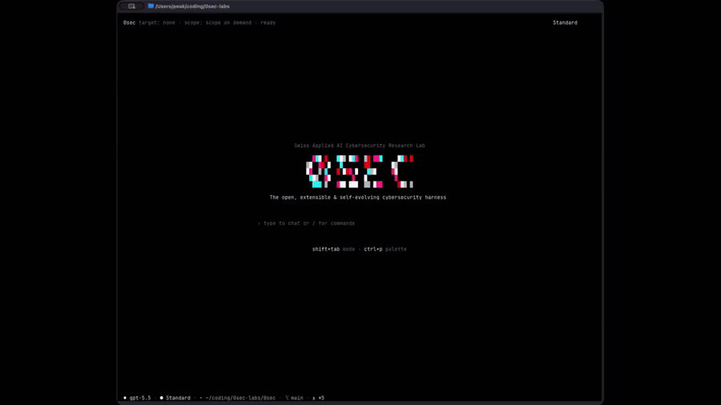
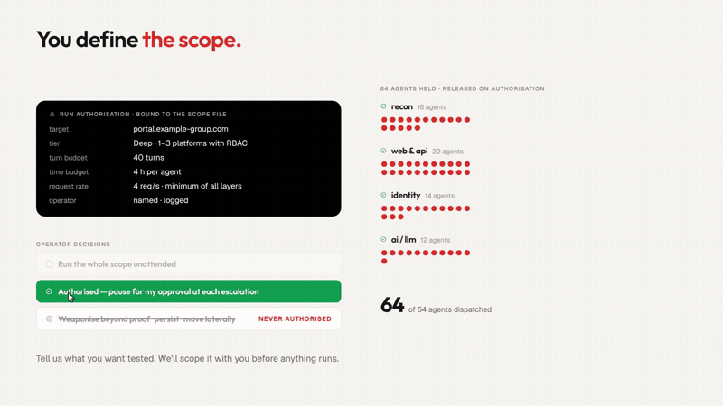
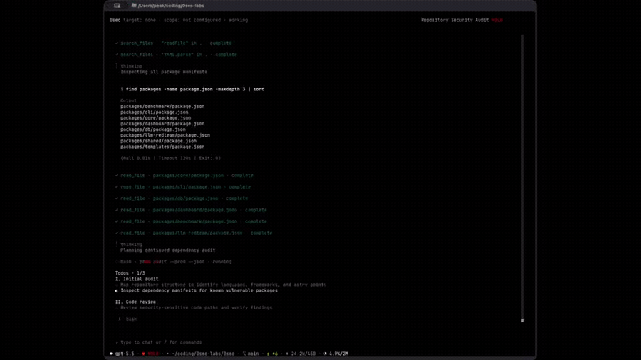
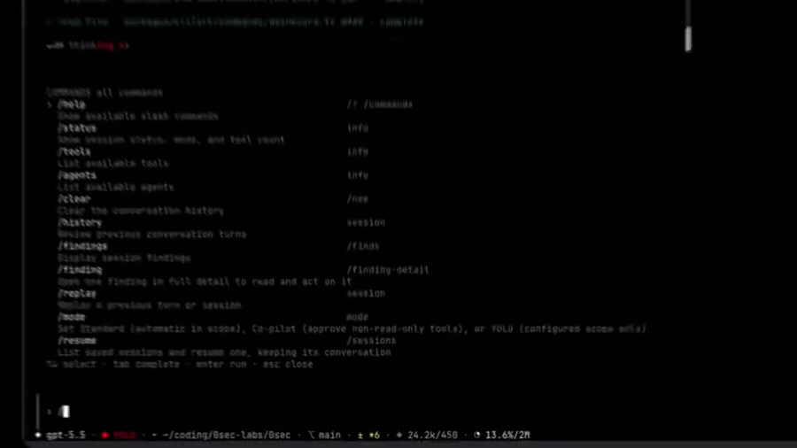
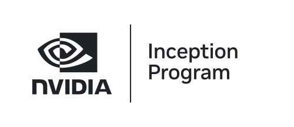

<p align="center">
  <picture>
    <source media="(prefers-color-scheme: dark)" srcset="assets/0sec-aperture-white.svg">
    
  </picture>
</p>

<h1 align="center">0sec</h1>

<p align="center">
  <strong>Your open-source AI cybersecurity agent.</strong><br/>
  It hacks, proves the problem, and writes the fix. Multi-model, multi-agent, but most importantly: yours.
</p>

<p align="center">
  
  
  
  
</p>

<p align="center">
  <sub>Created by the <strong>Swiss Applied AI Cybersecurity Research Lab</strong> · <a href="https://0.security">0.security</a></sub><br/>
  <sub>Beta — in active development; interfaces may change. See <a href="#honest-limitations">Honest limitations</a>.</sub>
</p>

<p align="center">
  
</p>

## Install

```bash
curl -fsSL https://raw.githubusercontent.com/0sec-labs/0sec/main/install.sh | bash
0 --help
```

Verified release binary (SHA-256 checked) → `~/.0sec/bin`. macOS (Apple Silicon) and Linux (x64/arm64); Windows: `0sec-windows-x64.exe` from the release; Docker: `ghcr.io/0sec-labs/0sec:latest`. Not on npm.

## Quick start

```bash
# 1. say what you're allowed to touch
echo '{ "in_scope": ["example.com"] }' > scope.json
export ANTHROPIC_API_KEY=...        # or OpenAI, Azure, OpenRouter, Ollama, …

# 2. scan a live target (out-of-scope requests are refused)
0 scan --target https://example.com --scope ./scope.json

# 3. or review code, audit a package, open the console
0 review ./my-app                   # source review
0 audit lodash                      # npm / pypi / cargo / oci package
0 console --scope ./scope.json      # interactive; type / for commands
```

<p align="center">
  
</p>

## What it covers

Most tools stop at the app. 0sec goes all the way down.

| Layer | Finds |
| --- | --- |
| Web apps | SQLi, IDOR, XSS, SSRF, auth bypass |
| APIs | tenant isolation, BOLA, business-logic abuse |
| AI & LLMs | prompt injection, jailbreaks, MCP tool abuse |
| Source code | injection, auth, deserialization, memory safety |
| Dependencies | supply chain, malicious packages, CVE replay |
| Network / identity | AD, cloud, federation (read-only, offline) |
| Runtime / OS / kernel | container escape, privesc, 0-day hunt |
| Compiled binaries | no source → [`0verse`](0verse/README.md) |

## Commands

| Task | Commands |
| --- | --- |
| Pentest web / AI-LLM / MCP | `scan`, `eval`, `agent-assure` |
| Review source / packages / kernel | `review`, `file-review`, `deep-review`, `audit` |
| Recon an attack surface | `recon`, `js-recon`, `npm-discovery`, `intel` |
| Hunt a bug class / kernel variants | `hunt`, `kernel`, `cve` |
| Work with evidence | `findings`, `history`, `resume`, `replay`, `verify`, `disclose` |
| Generate & re-test a fix | `fix` |
| Identity / AD (read-only) | `identity`, `adgraph`, `entragraph` |
| Integrate | `mcp-server`, `console`, `tui`, `dashboard` |

Run `0 --help` for the rest. Full docs: **[docs.0.security](https://docs.0.security)**.

<p align="center">
  <br/>
  <sub>The interactive console — <code>/</code> opens the command palette.</sub>
</p>

## How it works

It proves the bug before it reports it.

- **Free-form agents, hard guardrails.** Models decide what to probe; turn budgets, loop detection, and scope-on-every-call keep them in line.
- **Reproduce before trust.** A blind agent re-exploits each finding from the PoC alone. What it can't reproduce is dropped.
- **Triage before verify.** Class oracles and a second scanner cut noise before the expensive step.
- **Bring your own model.** Anthropic, OpenAI, Azure, OpenRouter, or local Ollama — you hold the key.

Every run keeps its own evidence under `~/.0sec/runs/<id>/`, so you can `resume`, `replay`, or `disclose` it later.

<p align="center">
  <br/>
  <sub>Blind verification — every finding is re-exploited before it ships.</sub>
</p>

## Track record

0sec has landed real, maintainer-reviewed fixes in the **mainline Linux kernel** and other open source. The verified list lives at **[0.security](https://0.security)**. Benchmarks are secondary evidence — caveats in the [benchmark docs](docs/src/content/docs/benchmark.md).

## Supported by

With special thanks to the startup and research programs supporting our work:

<p align="center">
  <a href="https://aws.amazon.com/startups/" title="AWS Startups">
    <picture>
      <source media="(prefers-color-scheme: dark)" srcset="docs/assets/supported-by/aws-startups-dark.png">
      
    </picture>
  </a>
  &nbsp;&nbsp;&nbsp;&nbsp;&nbsp;&nbsp;
  <a href="https://www.microsoft.com/en-us/startups" title="Microsoft for Startups">
    <picture>
      <source media="(prefers-color-scheme: dark)" srcset="docs/assets/supported-by/microsoft-for-startups-dark.png">
      
    </picture>
  </a>
  &nbsp;&nbsp;&nbsp;&nbsp;&nbsp;&nbsp;
  <a href="https://e2b.dev/startups" title="E2B for Startups">
    <picture>
      <source media="(prefers-color-scheme: dark)" srcset="docs/assets/supported-by/e2b-dark.svg">
      
    </picture>
  </a>
  &nbsp;&nbsp;&nbsp;&nbsp;&nbsp;&nbsp;
  <a href="https://hack-nation.ai/" title="Hack Nation">
    <picture>
      <source media="(prefers-color-scheme: dark)" srcset="docs/assets/supported-by/hacknation-dark.png">
      
    </picture>
  </a>
  &nbsp;&nbsp;&nbsp;&nbsp;&nbsp;&nbsp;
  <a href="https://www.nvidia.com/en-us/startups/" title="NVIDIA Inception Program">
    <picture>
      <source media="(prefers-color-scheme: dark)" srcset="docs/assets/supported-by/nvidia-inception-dark.svg">
      
    </picture>
  </a>
</p>

## Honest limitations

- Kernel/IOKit findings stay hypotheses until a real oracle reproduces them (the `linux-kernel` profile is static).
- Verification depth varies: `verificationSpec` covers file/diff predicates; the replay runner is local-shell only (Docker/QEMU are stubs).
- The false-positive-moat layers are off by default and slice-dependent.
- Benchmarks are single-model/config/trial; the 10/10 AI-suite is self-authored, not independent.
- `fix` is narrow: source-only, single-file, ≤3 attempts.
- By design, never: network sweeps, credential spraying, persistence/C2, or stealth.

## Managed service

The public engine runs locally or in CI. A separate managed service runs the same engine as a governed engagement — isolated workers, scheduling, evidence handling. It's not in this repo, and nothing here depends on it.

## Build from source

```bash
git clone https://github.com/0sec-labs/0sec.git && cd 0sec
corepack enable && pnpm install --frozen-lockfile && pnpm build && node dist/0sec.js --help
```

## Contributing & security

See [CONTRIBUTING.md](CONTRIBUTING.md) — synthetic or authorized targets only. Report vulnerabilities privately via [SECURITY.md](SECURITY.md) (security@0sec.ai), not public issues.

## License

Dual-licensed **MIT OR Apache-2.0** — see [LICENSE](LICENSE) / [LICENSE-MIT](LICENSE-MIT). © 2026 0sec Labs.
