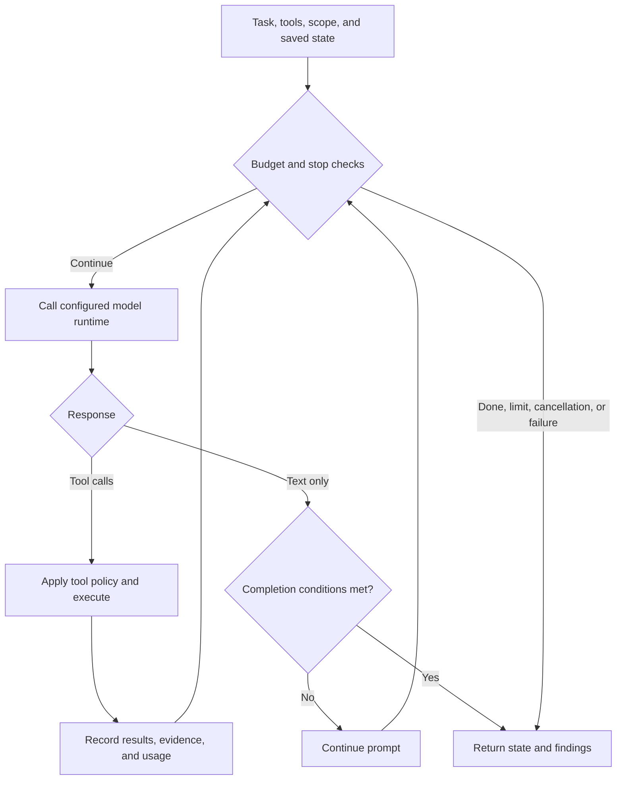

0sec runs assessments by putting a model in a loop with tools. The model reads
the task, proposes tool calls, receives their results, and decides what to do
next. Deterministic tool policies, budget checks, and verification constrain
that process; model reasoning alone is not evidence.

## Loop overview

The core native loop is `runNativeAgentLoop` in
`packages/core/src/agent/native-loop.ts`. It exchanges structured messages and
tool calls through the configured native runtime. Its internal `tool_use` /
`tool_result` representation does not mean that every request goes to Anthropic;
provider adapters translate the wire protocol. A separate legacy text loop
exists for applicable process-runtime paths.



Each iteration is one **turn**. The caller supplies `maxTurns`; budgets differ
by workflow, role, and depth. The loop can finish on `done`, a qualifying
text-only completion, a limit, cancellation, or an error. Optional compaction,
loop detection, and budget warnings operate around this cycle.

Strategy racing and EGATS are separate opt-in orchestration paths, not steps
every normal loop executes. `scan --race` is benchmark/CTF-oriented, not a
recommended setting for ordinary live-target audits.

## What the agent sees

**System prompt** — the most important input. It says what the agent is, what
tools it has, and how to approach the target. 0sec assembles a different prompt
per mode:

- `shellPentestPrompt` (web) — gives `bash`, `save_finding`, `done` and tells
  the agent to probe with curl/python3/CLI tools. No structured HTTP tools.
- `discoveryPrompt` / `attackPrompt` (LLM/AI) — probing endpoints, extracting
  system prompts, testing jailbreaks.
- `researchPrompt` (source) — map the codebase, trace input → sink, write PoCs.

The prompt includes concrete target details: URL, known endpoints, detected
features, and (for attack agents) discovery results.

**Tool results** — after each call, stdout/stderr, HTTP bodies, or structured
tool output is appended as a `tool_result` message. The agent reasons about
actual server responses, not hypothetical ones.

**Budget-aware reflection** — when the agent replies with text but no tool call
(thinking out loud instead of acting), the loop injects a continue prompt that
escalates with budget spent:

| Budget used | Prompt |
|---|---|
| < 30% | "Use your tools. Start sending requests." |
| 30-50% | "Summarize what you learned. Top hypothesis?" |
| 50-70% | "HALFWAY. List every approach tried. Most promising untested vector?" |
| 70-85% | "URGENCY. If the current approach isn't working, SWITCH NOW." |
| 85-100% | "FINAL PUSH. Highest-confidence exploit path ONLY." |

These are continuation nudges, not a guarantee that the model changes strategy.
Feature-gated budget warnings can also fire during ordinary tool-call turns.
See [Budget Management](/budget-management/) for limits and warning behavior.

## Tool execution

`ToolExecutor` in `packages/core/src/agent/tools.ts` handles all calls. The
three that matter most for web:

- **`bash`** — runs shell commands and returns execution output. It is subject to
  scope and tool policy; by default it executes on the host, not in an OS sandbox.
- **`save_finding`** — records a candidate and its evidence; where database
  persistence is configured the finding survives beyond the loop. Saving alone
  is not independent verification.
- **`done`** — signals completion with a summary; sets `state.done = true` and
  exits.

Other tools by mode: `http_request`/`submit_form` (structured HTTP),
`send_prompt` (LLM), `read_file`/`run_command` (source), `crawl` (spidering),
`browser` (Playwright). `spawn_agent` creates one sub-agent with fresh context
to dig into a specific vuln; `spawn_agents` launches a bounded batch of such
sub-agents that run **concurrently**, each with its own turn budget. Sub-agents
can't spawn their own sub-agents.

## How it decides

The model chooses the next hypothesis and action within the supplied task and
tool surface. The harness still contains deterministic rules, optional playbooks,
scope enforcement, and evidence gates. Shell-first execution gives the model
flexibility; it does not grant unrestricted permission to act.

## Walk-through: IDOR exploitation

Illustrative sequence in an authorized disposable lab at `http://target:8080`
(not a recorded run or a promised turn count):

1. **Recon.** `curl -i http://target:8080/` returns a login form and a footer:
   "Demo credentials: demo / demo".
2. **Auth.** `curl -c /tmp/jar -b /tmp/jar -d 'username=demo&password=demo' -L
   .../login` → 302 to `/dashboard` with a session cookie.
3. **Enumerate.** `/profile` loads `/api/users/1`, showing `"id": 1, "username":
   "demo"`.
4. **IDOR probe.** `curl -b /tmp/jar .../api/users/2` returns another user:
   `"id": 2, "username": "admin", …, "flag": "FLAG{idor_1a2b3c}"`.
5. **Save + finish.** `save_finding` with the request, the leaking response, and
   analysis; then `done`.

The relevant result is the cross-user access observation under known test
identities, not the flag-shaped string. A separate verification step must assess
whether the behavior supports the finding.

## Debugging

Use `--verbose` on commands that support it to expose more progress and tool
detail. Output varies by workflow; it is not a guarantee of a complete raw
provider transcript. Treat logs as sensitive and redact before sharing them.

Common patterns:

- **Loops on one payload** — inspect repeated tool results, scope denials, and
  access failures before increasing the budget.
- **Provider errors or empty responses** — check the reported provider/model,
  credentials, availability, and rate limits; see [Troubleshooting](/troubleshooting/).
- **Exits too early** — the loop requires at least 4 turns (or `maxTurns` if
  smaller) before a text-only exit. Finishing in 2-3 turns means a premature
  `done`.
- **No findings saved** — the agent may be finding vulns but not calling
  `save_finding`. Check verbose output.

**Saved history and timeline** — list runs, then inspect the event timeline for
a known scan ID:

```bash
0sec history --limit 10
0sec timeline <scan-id> --db-path ~/.0sec/runs/<scan-id>/state.db
```

`timeline` reads the selected database; it does not search every run-local
database by scan ID. Adjust the path if you use a different state directory.

The native loop checkpoints SQLite session state every 2 turns when a database
is configured, and persists again at completion. Journal-backed continuation
and console transcript resume are different mechanisms. Follow
[Scan Workflows](/scan-workflows/) for scan recovery and [Console](/console/)
for chat-session resume; do not assume an interrupted tool can be safely rerun.
