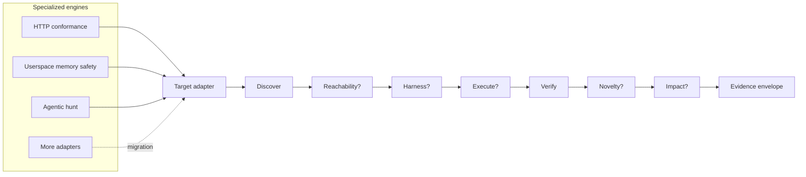
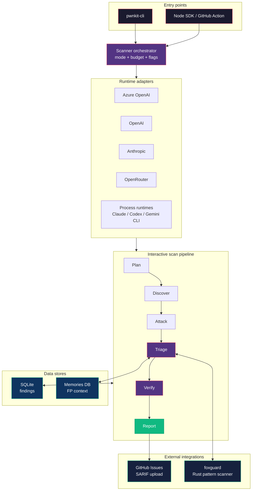
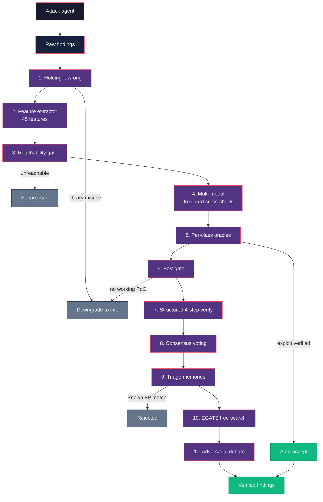

pwnkit has two complementary control loops. The interactive scan pipeline drives
web, LLM, package, and source engagements. The shared research plane lets
specialized engines use one evidence lifecycle without flattening their native
harnesses and oracle results.

## Shared research plane

Different targets require different proof machinery. An HTTP protocol rule is
tested with requests and a deterministic response oracle. A userspace memory bug
needs a sanitizer build and saved input. A kernel finding may require a configured
VM and repeated boots. The adapter contract preserves those differences while the
runner owns stage order, artifacts, cancellation, warnings, and cleanup.



Only discovery and verification are mandatory. Unsupported optional stages are
explicitly `skipped`; failed or unavailable proof stays `inconclusive`. Discovery
output cannot promote itself.

Evidence dimensions remain separate:

| Dimension | Meaning |
|---|---|
| Proof grade | `candidate → reachable → observed → reproduced → impact-proven` |
| Novelty | `unchecked`, `novel`, `duplicate`, or `inconclusive` |
| Execution privilege | Platform-explicit Linux `zero-cap`, Windows `windows-restricted`, `privileged`, or `unknown`, with an evidence basis |
| Provenance | Target/build/config identity, producer, model, attempt, and run |
| Native evidence | Complete protocol attempts, sanitizer crashes, hunt records, or future VM proofs |

A result is not disclosure-ready merely because it is reproduced. The shared
helper currently requires reproduced evidence plus a real novelty receipt;
scope, publishability, redaction, and operator policy remain downstream gates.
Proof grade does not imply attacker privilege. The zero-cap helper additionally
requires runtime attestation of non-root real and effective UIDs, an all-zero
effective capability set, and a digest-bound attestation artifact; runner
contracts, declarations, and campaign configuration fail closed. The attested
execution must also have `no_new_privs` set so a later exec cannot regain
privilege through setuid or file capabilities.
Windows LPE readiness uses a separate token-transition gate; Linux UID and
capability facts are never treated as Windows proof. It requires an explicitly
Windows context, a retained runtime-attestation artifact and receipt, exact
Canary `BuildLabEx`/campaign/worker/manifest binding, at least two target trials
and two clean controls, and a distinct retained capture for every run. Counts
are derived from contiguous, nonce-unique target/control rows whose raw token
facts and artifact digests bind the same scope, grant, acceptance, build, and
campaign; producer-supplied scalar counts are insufficient. The start must be
low/medium, non-elevated, non-admin-enabled, and free of dangerous enabled
privileges; the distinct finish token must be high-integrity administrator or
LocalSystem. LocalSystem requires its well-known SID, System integrity,
`TokenIsElevated`, an unrestricted token, and `TokenElevationTypeDefault`;
LPAC remains unclaimable until its distinct raw token-information bit is
captured. Benchmark/fixture rows and automatic disclosure fail closed, and
human review remains mandatory. These hashes provide retained-artifact binding,
not hardware-backed attestation of a hostile worker. The shared gate operates
on normalized facts: an upstream adapter must parse and verify the signed
capture bytes before constructing this envelope; matching an inline hash to an
artifact-list entry alone does not verify the bytes or signature.
For Linux N-of-K verification, every reproduced boot must provide a bound
receipt and the aggregate manifest is the evidence artifact. The trust boundary
includes the VM kernel, guest init, and launcher; this is execution attestation,
not TPM/SEV remote attestation. The direct guest launcher must share PID 1's
trusted PID namespace so its pre-drop user-namespace reference anchors the
post-drop identity; nested-PID deployments must receive that reference from
trusted guest init instead.
Schema-v2 receipts additionally require an exact private staged kernel-image
digest, its associated build-config digest, an independently observed runtime
kernel release, and a canonical fresh boot UUID. QEMU boots the staged image and
the host hashes both staged artifacts before and after the VM run,
and the N-of-K manifest binds every receipt and dmesg digest while rejecting
mixed kernels or repeated boot IDs. These are trusted-orchestrator bindings,
not hardware-backed measurements of a hostile VM. In particular, the associated
config digest is not proof of the runtime config without `/proc/config.gz` or
equivalent measured-build provenance.

Current adapters:

| Adapter | Native proof | Status |
|---|---|---|
| HTTP protocol conformance | Concrete request/response plus deterministic RFC oracle | Connected |
| Userspace memory safety | Fuzz loop, sanitizer/Miri crash, saved input, primitive classification | Connected |
| Agentic hunt | Best-of-N records, judge, skeptic/prover, native novelty result | Connected |
| Linux kernel reproducer | Fresh-boot N-of-K signature gate with dmesg binding | Connected |
| Linux external boot matrix import | Versioned vulnerable/patched manifest, unique boot markers, clean-control gate, snapshotted and hashed logs | Connected; explicitly external provenance |
| Windows Hyper-V evidence import | Build/campaign/worker-bound 0verse receipt, clean controls, repeated crash signature, retained dumps and sidecars | Connected for crash reproduction; LPE disclosure remains fail-closed until a token-transition attestation is present |
| Mobile static intake | Typed candidates and explicitly scoped downstream-target handoff; no passive promotion | Connected |
| XNU IOKit | Selector discovery, reachability hints, deterministic programs; panic promotion disabled | Partially connected, fail-closed |
| Unified web/AI/source/package/on-chain pipeline | Native retained findings wrapped without rerunning the pipeline | Connected |

The shared differential runner can execute identical input against two versions,
builds, configurations, or implementations. A failed side makes the comparison
inconclusive, never divergent. Novelty providers are likewise pluggable by
ecosystem; zero successfully checked records can never produce a novel verdict.

Each shared research run writes compact evidence envelopes under its artifact
directory. The research CLI emits envelope-bearing findings through the existing
cloud sink after attachment, and the orchestrator stores them as versioned JSONB
receipts. Deduplicated retries backfill the stronger receipt. Legacy scans are not
retroactively backfilled, so do not infer that every older finding already has one.

Custom kernel harnesses often require an initramfs, out-of-tree modules, or a
race widener that the generic VM runner cannot safely reconstruct. Use
`pwnkit research linux-matrix --matrix matrix.json --finding finding.json` to
import those externally executed boots. The versioned manifest binds build IDs,
the literal crash and completion oracles, per-boot identity markers, thresholds,
and vulnerable/patched log paths. pwnkit snapshots and hashes the manifest,
every log, and its computed verdict. The envelope says `executionOrigin:
external`; it never claims pwnkit executed the boots or that clean controls
prove universal patch safety.

The native `pwnkit research linux` path binds verification to a required
literal crash oracle (`--expected-signature`). A different KASAN/oops/GPF is
recorded but cannot satisfy the N-boot gate. Each attempted boot contributes a
separate hashed dmesg artifact, so a 2-of-3 claim is backed by the complete
three-boot audit trail rather than one representative log.

## Interactive scan pipeline

For web pentesting, the agent uses a shell-first approach -- `bash` (curl,
python3, bash) is the primary tool, not a constrained HTTP DSL. LLM and code
targets receive specialized tools such as `send_prompt` and `read_file`. Raw
findings pass through triage and blind validation before reporting.

### System architecture



## The interactive pipeline

The interactive pipeline has six named stages:

```
Plan -> Discover -> Attack -> Triage -> Verify -> Report
```

These stages are grouped into two agent sessions:

### 1. Research agent (Plan + Discover + Attack + PoC)

A single agent session that:

1. **Plans** the engagement -- estimates target difficulty, identifies likely vulnerability classes, and prioritizes attack vectors. Research into top pentesting agents ([KinoSec](https://kinosec.ai) at 92.3%, [XBOW](https://xbow.com) at 85%, [MAPTA](https://arxiv.org/abs/2508.20816) at 76.9%) shows that planning before execution is a shared trait of high-performing agents. The plan is injected into the system prompt so the agent starts with a strategy rather than fumbling through discovery.
2. **Discovers** the attack surface -- maps endpoints, detects models, identifies features, fingerprints web technologies, and enumerates exposed paths
3. **Attacks** the target -- crafts multi-turn attacks spanning prompt injection, jailbreaks, tool poisoning, data exfiltration (LLM), CORS misconfiguration, SSRF, XSS, path traversal, header injection (web), supply chain and malicious code analysis (npm), and vulnerability patterns (source code)
4. **Writes PoC code** -- produces a proof-of-concept that demonstrates each vulnerability

**Challenge hints.** When available, challenge descriptions are passed to the agent as context. This is standard practice -- [XBOW provides challenge descriptions to all agents](https://xbow.com/blog/core-components-ai-pentesting-framework) in their benchmark. It is not benchmark-specific tuning; it is how a real pentester would receive a scope document.

The research agent's tool set depends on the target type:

- **Web targets:** `bash` (primary -- run curl, python3, bash, sqlmap, anything), `browser` (Playwright-based headless browser for XSS testing and JavaScript-rendered pages), `save_finding`, `done`. The structured tools (`crawl_page`, `submit_form`, `http_request`) are available but optional -- benchmarking showed the agent performs better with just shell access.
- **LLM targets:** `send_prompt` (talk to AI/LLM apps), `bash`, `save_finding`, `done`.
- **Source/npm targets:** `read_file`, `search_code`, `list_files`, `run_command`, `save_finding`.

The agent adapts its strategy based on what it discovers -- if a naive prompt injection fails, it may try encoding bypasses, multi-turn escalation, or indirect injection. For web apps, it escalates from fingerprinting to active exploitation using real pentesting tools via shell. For source code, it traces data flows from user input to dangerous sinks.

**Reflection checkpoints.** When the agent reaches 60% of its turn budget, pwnkit injects a reflection prompt forcing the agent to review what has been tried, what failed, and what alternative approaches remain. This is inspired by [deadend-cli](https://xoxruns.medium.com/feedback-driven-iteration-and-fully-local-webapp-pentesting-ai-agent-achieving-78-on-xbow-199ef719bf01) (78% on XBOW) and [PentestAgent](https://arxiv.org/abs/2508.20816)'s self-reflection mechanism. Without reflection, agents frequently stall on a single approach and exhaust their budget.

**Turn budget.** [MAPTA](https://arxiv.org/abs/2508.20816) data shows 40 tool calls is the sweet spot for CTF-style challenges -- enough to complete multi-step exploit chains without wasting tokens on dead ends. Deep mode uses a budget of 40 turns (increased from the original 20).

### 2. Triage stage (Finding verification pipeline)

Between the research agent's raw findings and the final report, findings flow through a multi-layer triage pipeline. Each layer rejects, downgrades, or confirms findings based on independent signals. See the [FP Reduction Moat](/research/fp-reduction-moat/) page for the measured per-profile results from the 2026-04-11 ablation, the [2026-04-11 ablation results log](/research/2026-04-11-ablation/) for experiment context and raw artifacts, and the [Finding Triage ML](/research/finding-triage-ml/) design doc for the underlying research.

> **Note on EGATS (layer 11):** The single-feature ablation on 2026-04-11 found that `egatsTreeSearch` is the one layer that regresses solve rate on hard challenges and costs ~10× the next-worst layer per flag. It has been removed from the `moat` and `moat-only` profile aliases in CI and is now opt-in only. See [pwnkit#116](https://github.com/0sec-labs/pwnkit/issues/116). The broader takeaway: the moat's effect is mode-dependent — strictly positive on XBOW black-box, a Pareto tradeoff on XBOW white-box, a no-op on npm-bench. A static scan-level policy can't optimize all three slices, which is the direct motivation for the learned-routing work in [pwnkit#113](https://github.com/0sec-labs/pwnkit/issues/113).



| Layer | Module | Purpose |
|-------|--------|---------|
| Holding-it-wrong filter | `packages/core/src/triage/holding-it-wrong.ts` | Rejects findings where the "vulnerability" is the documented behaviour of the called function (e.g. `eval`, `writeFile`, `compile`). Downgrades to `info`. |
| Feature extractor | `packages/core/src/triage/feature-extractor.ts` | 45 handcrafted features (response, request, metadata, text quality, cross-field) for fast first-pass signal. |
| Reachability gate | `packages/core/src/triage/reachability.ts` | Suppresses findings whose sink is not reachable from an application entry point. Open-source mirror of Endor Labs' "Code API" moat. |
| Multi-modal agreement | `packages/core/src/triage/multi-modal.ts` | Cross-validates against [foxguard](https://github.com/0sec-labs/foxguard) (Rust pattern scanner). Both fire = strong signal; foxguard silent on scanned file = likely FP. |
| Per-class oracles | `packages/core/src/triage/oracles.ts` | Deterministic exploit oracles per category (SQLi, XSS, SSRF, RCE, path traversal, IDOR). Verified = accept with no LLM call. |
| PoV gate | `packages/core/src/triage/pov-gate.ts` | Narrowly-scoped mini agent loop must produce a working executable PoC. No PoV = downgrade to `info`. Based on "All You Need Is A Fuzzing Brain". |
| Structured verify pipeline | `packages/core/src/triage/verify-pipeline.ts` | 4-step LLM verification: reachability -> payload validation -> impact assessment -> exploit confirmation. Category-specific addendums per vuln class. |
| Consensus verify | `packages/core/src/triage/verify-pipeline.ts` (`runSelfConsistencyVerify`) | Runs the structured verify pipeline N times in parallel and takes the majority vote with early termination. |
| Triage memories | `packages/core/src/triage/memories.ts` | Semgrep-style per-target FP memories. Injected as few-shot into the verify prompt; strong matches auto-reject without an LLM call. |
| Adversarial debate | `packages/core/src/triage/adversarial.ts` | Prosecutor vs. defender vs. judge with fresh contexts, based on Anthropic's debate paper (arXiv:2402.06782). Uncorrelated error modes vs. single-pass verify. |

Most layers are gated by feature flags (`PWNKIT_FEATURE_REACHABILITY_GATE`, `PWNKIT_FEATURE_MULTIMODAL`, `PWNKIT_FEATURE_CONSENSUS_VERIFY`, `PWNKIT_FEATURE_POV_GATE`, `PWNKIT_FEATURE_TRIAGE_MEMORIES`, `PWNKIT_FEATURE_DEBATE`) so they can be A/B tested independently. See `packages/core/src/agent/features.ts` for the full list.

### 3. Verify agent (Blind validation)

The verify agent receives **only** the PoC code and the file path. It never sees the research agent's reasoning, chain of thought, or attack strategy. This is the same principle as double-blind peer review.

The verify agent independently:

- Traces data flow from the PoC
- Attempts to reproduce the finding
- Confirms or kills the finding

If the verify agent cannot reproduce the vulnerability, it is killed as a false positive. This eliminates the noise that plagues other scanners.

### 4. Report (Output)

Only confirmed findings (those that survived blind verification) are included in the final report. Output formats:

- **Terminal** — default interactive summary with share URL
- **HTML** — rich browser report
- **PDF** — printable report
- **SARIF** — for the GitHub Security tab
- **Markdown** — human-readable report
- **JSON** — machine-readable for pipelines

Each finding includes a severity score, category, PoC code, and remediation guidance.

## Scan modes

The pipeline adapts its tooling and attack strategy based on the target type:

| Mode | Target | What it does |
|------|--------|-------------|
| `deep` | LLM API URL | Prompt injection, jailbreaks, tool poisoning, data exfiltration, multi-turn escalation (40-turn budget) |
| `probe` | LLM API URL | Lightweight surface scan of an LLM API |
| `web` | Web application URL | CORS, headers, exposed files, SSRF, XSS, path traversal, fingerprinting |
| `mcp` | MCP server | Tool poisoning, schema abuse, permission escalation |
| `audit` | Package or image name | Supply chain analysis, malicious code detection, dependency risk across `npm`, `pypi`, `cargo`, and `oci` |
| `review` | Local path or GitHub URL | AI-powered source code vulnerability analysis |

The mode is auto-detected from the target when possible, or set explicitly with `--mode`.

## Runtime adapters

pwnkit decouples the scanning pipeline from the LLM backend through runtime adapters. Each adapter implements the same interface but connects to a different provider:

| Adapter | Backend | How it works |
|---------|---------|-------------|
| `ApiRuntime` | OpenRouter / Anthropic / OpenAI | Direct HTTP calls to the provider's API |
| `ClaudeRuntime` | Claude Code CLI | Spawns `claude` as a subprocess with tool definitions |
| `CodexRuntime` | Codex CLI | Spawns `codex` as a subprocess |
| `GeminiRuntime` | Gemini CLI | Spawns the Gemini CLI |
| `McpRuntime` | MCP servers | Connects to Model Context Protocol servers |
| `AutoRuntime` | Best available | Detects installed CLIs and picks the best per stage |

The `--runtime` flag selects which adapter to use. The `auto` runtime probes for installed CLIs and picks the most capable one for each pipeline stage (for example, using Claude for deep reasoning and the API for quick classification).

## MCP integration

pwnkit integrates with the Model Context Protocol (MCP) in two ways:

### As an MCP client

The `McpRuntime` adapter can connect to MCP servers, using their exposed tools as the LLM backend for the scanning pipeline. This enables using any MCP-compatible model server.

### Scanning MCP servers

The `--mode mcp` scan mode probes MCP servers for:

- **Tool poisoning** — malicious tool definitions that inject instructions
- **Schema abuse** — tool schemas designed to exfiltrate data
- **Permission escalation** — tools that request more access than needed

## Product model

The product is intentionally split into two surfaces:

- **CLI** — the execution surface for local runs, CI, replay, and exports
- **Dashboard** — the local verification workbench for triage, evidence review, and human sign-off

The CLI runs scans and produces findings. The dashboard consumes those findings and provides a Kanban-style board for triage, evidence inspection, and disposition tracking. Both share the same local SQLite database.

## Shell-first approach (web mode)

For web application pentesting, pwnkit uses a shell-first approach. Instead of routing the agent through structured tools like `crawl_page`, `submit_form`, or `http_request`, the web mode gives the agent a minimal tool set:

- `bash` — run any bash command (curl, sqlmap, python, nmap, etc.)
- `save_finding` — record a confirmed vulnerability with PoC
- `done` — signal completion

This works because the model already knows curl, bash pipelines, and standard pentesting tools from training data. A single `curl -c cookies.txt ... | jq` command replaces multiple structured tool calls and eliminates the state-threading confusion that causes agents to loop.

The structured tools (`crawl_page`, `submit_form`, `http_request`) are still available as optional additions, but benchmarking showed the agent performs better with just shell access.

See the [Research](/research/) page for the full rationale and data behind this design decision and the [Benchmark](/benchmark/) page for detailed results.

## Agent tools

Each agent has access to a set of tools depending on the scan type:

| Tool | Used in | Purpose |
|------|---------|---------|
| `bash` | Web, LLM, Verify | **Primary tool for web pentesting.** Run any shell command (curl, python3, bash, sqlmap, nmap, etc.). Renamed from `shell_exec` to match [pi-mono](https://github.com/badlogic/pi-mono)'s naming convention. |
| `browser` | Web | Playwright-based headless browser for XSS testing and JavaScript-rendered pages. Complements `bash`/curl for cases where a real browser DOM is needed. |
| `save_finding` | All modes | Record a discovered vulnerability with PoC |
| `done` | All modes | Signal that the agent has finished |
| `send_prompt` | LLM | Send prompts to AI/LLM apps |
| `read_file` | Source, npm | Read source files for code review |
| `run_command` | Source, npm | Execute commands in a sandbox |
| `list_files` | Source, npm | Enumerate files in a directory |
| `search_code` | Source, npm | Search for patterns across a codebase |
| `crawl_page` | Web (optional) | Crawl a web page -- available but `bash` with curl is preferred |
| `submit_form` | Web (optional) | Submit a form -- available but `bash` with curl is preferred |
| `http_request` | Web (optional) | Send HTTP requests -- available but `bash` with curl is preferred |
