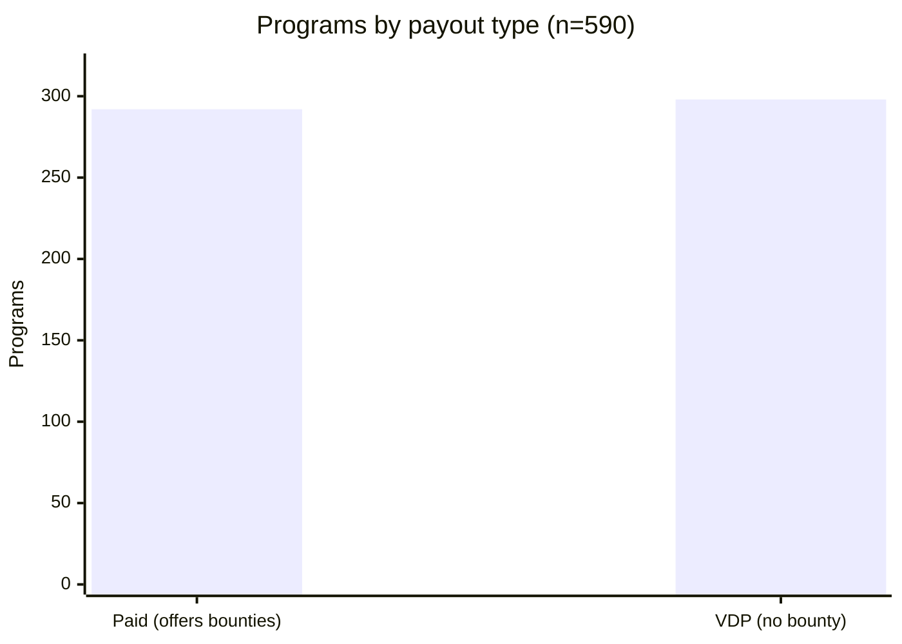
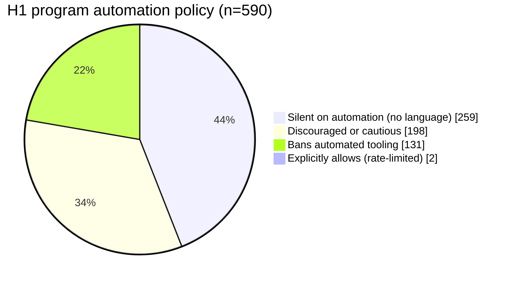
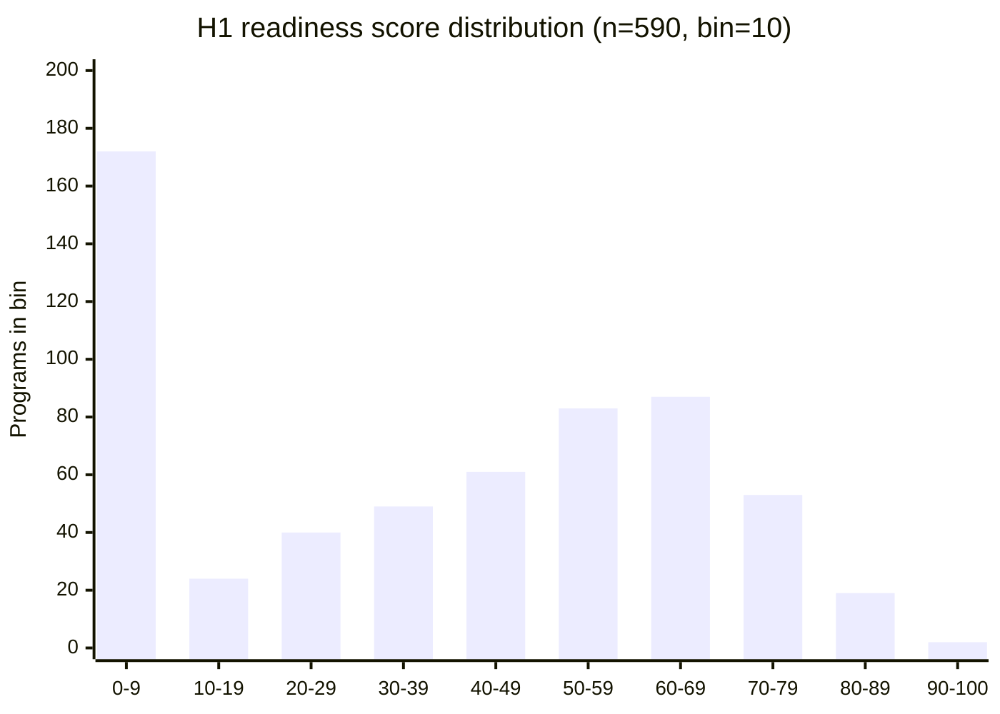
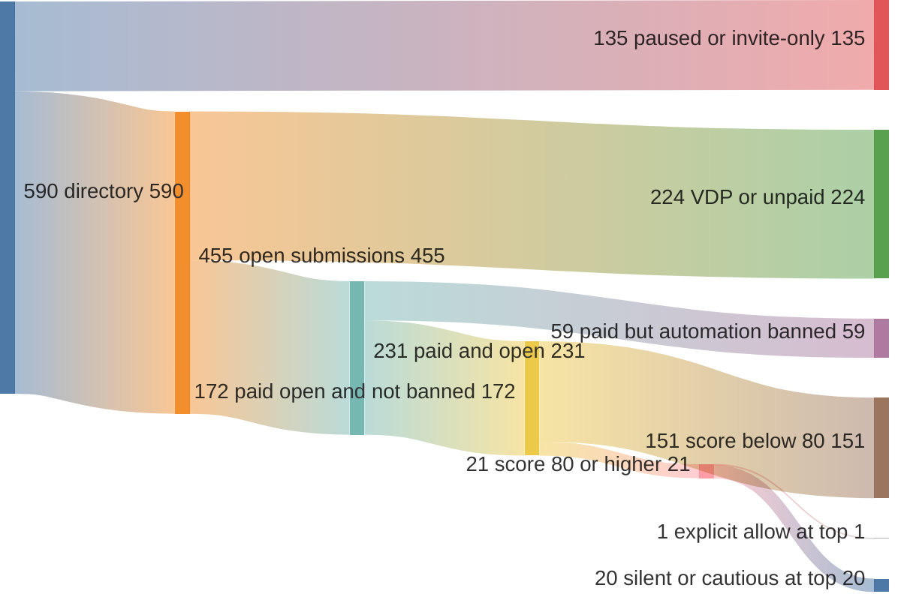
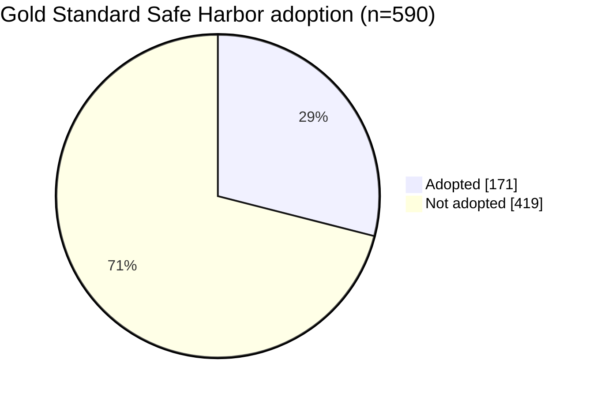

> **Historical research log (2026-05-06).** A dated lab note kept for transparency. It reflects the HackerOne policy landscape at the time and is not current legal or operational guidance.

*Published 2026-05-06. Audited program identities and raw records remain private.*

## Question

This audit examined automation policies and submission prerequisites for programs
visible to one researcher account. [XBOW scores](https://github.com/xbow-engineering/validation-benchmarks)
measure challenge performance; program authorization requires a separate policy review.

## What changed in 2026

On May 11, 2026 HackerOne shipped a community-terms update that explicitly addresses AI-driven submissions ([HackerOne Code of Conduct](https://www.hackerone.com/policies/code-of-conduct), revised May 2026). Three things changed:

1. **A new "Commercial Community Member" (CCM) designation** for organisations that run automation against the platform. CCMs are bound by stricter conduct rules than individual researchers and must self-identify when their submissions are agent-generated.
2. **An AI-misuse penalty matrix.** First offence is a Final Warning. Second offence is a 12-month account suspension. Third offence is a permanent ban. The criteria for "misuse" are enumerated in the CoC and include hallucinated endpoints, missing PoCs, fabricated patches, volume-firsting (mass-submitting low-quality reports to claim priority), out-of-scope reports, and excessive traffic.
3. **A platform-wide reminder** that program-level automation policies are binding. If a policy says "no automated tools," running a scanner is a CoC violation regardless of finding quality.

The curl project cited fabricated reports when announcing its bounty closure.
See [The New Stack](https://thenewstack.io/curl-bug-bounty-flooded-by-ai-slop/)
and [BleepingComputer](https://www.bleepingcomputer.com/news/security/curl-project-founder-snaps-over-ai-slop-bug-reports/).

## Audit methodology

The [HackerOne API](https://docs.hackerone.com/en/articles/8475119-hackerone-api) returned 590 programs visible to the researcher account on 2026-05-06.

For each program we fetched:

- The full program record (`/programs/<handle>`) — bounty status, submission state, Safe Harbor flag, open-scope flag, and the policy markdown.
- The structured-scopes endpoint (`/programs/<handle>/structured_scopes`) — the API-exposed asset list with type, identifier, eligibility-for-submission, and max-severity fields.

We then scored each program on six axes:

1. **Web-heavy ratio** — count of `URL` and `WILDCARD` assets divided by total scope items. Higher is better fit for a web-class agent.
2. **Bounty offered** — paid programmes weighted higher than VDPs.
3. **Submission state** — `open` weighted higher than `paused`.
4. **Automation-policy verdict** — regex classification over the policy markdown looking for terms like *automated*, *scanner*, *tool*, *fuzz*, and surrounding modifiers (*prohibited*, *not allowed*, *encouraged*, *with rate-limit*). Each program was bucketed into one of four classes: `banned`, `discouraged-or-cautious`, `silent`, or `allowed-with-rate-limit`.
5. **0sec-strength bug-class fit** — mentions of XSS, IDOR, SSRF, RCE, or SQLi in the policy markdown.
6. **Gold Standard Safe Harbor** — the program-level flag indicating adoption of the GSSH legal-protection wording.

Scores are normalized to 0–100: ≥80 is the study's high-readiness threshold;
≥70 identifies further review candidates. These screening scores confer no authorization.
Only aggregate results are published.

## Aggregate findings

### Population shape

| Slice | Count | % of 590 |
|-------|-------|----------|
| Total programs visible to researcher account | 590 | 100% |
| Paid bounty | 292 | 49.5% |
| VDP only (no bounty) | 298 | 50.5% |
| Submission state: `open` | 455 | 77.1% |
| Submission state: `paused` | 135 | 22.9% |
| Gold Standard Safe Harbor adopted | 171 | 29.0% |
| Open-scope declared | 56 | 9.5% |

The sample is roughly half paid programs and half VDPs. Nearly a quarter are paused; 29% adopt Gold Standard Safe Harbor.

*292 programs offer bounties; 298 are VDPs.*

### Automation-policy distribution

*Two of 590 policies (0.34%) explicitly allow rate-limited automation. The others were classified as banned, cautious, or silent.*

| Policy verdict | Count | % of 590 |
|----------------|-------|----------|
| `banned` (explicitly prohibits automation, scanners, or fuzzing) | 131 | 22.2% |
| `discouraged-or-cautious` (rate-limit language, "please avoid," "low-volume only") | 198 | 33.6% |
| `silent` (policy makes no statement either way) | 259 | 43.9% |
| `allowed-with-rate-limit` (policy explicitly permits automation) | **2** | **0.3%** |

Review current program terms and obtain required authorization before testing.
Silence in the classifier output establishes no permission.

### A finding on the platform itself

**23 of 292 paid programs (7.9%)** returned no usable structured-scope assets:
17 returned `data: []`; six returned only `OTHER` assets. Review policy text and
clarify scope with the program before proceeding. These counts describe this
account's observed API responses; program identities remain private.

### Scoring distribution

*172 programs scored below 10, 21 reached 80, and two reached 90.*

| Score band | Count | % of 590 |
|------------|-------|----------|
| ≥80 (AI-tool-ready) | 21 | 3.6% |
| 70–79 (workable with care) | 53 | 9.0% |
| 60–69 | 87 | 14.7% |
| 50–59 | 83 | 14.1% |
| 40–49 | 61 | 10.3% |
| 30–39 | 49 | 8.3% |
| 20–29 | 40 | 6.8% |
| 10–19 | 24 | 4.1% |
| <10 | 172 | 29.2% |

21 programmes clear the ≥80 bar (paid + open + web-shaped + automation explicit-or-tolerant). Adding the 70–79 band brings the total to 74 (12.5%). Most of the long tail is either VDP-only, paused, non-web, or carries explicit anti-automation language.

### The funnel

*Sequential filters: 590 visible → 455 open → 231 paid → 172 not-banned → 21 score 80+ → one explicit-allow.*

### Gold Standard Safe Harbor coverage

*GSSH adoption was 29% overall and 20/21 in the score-80+ group. GSSH is also an input to the score.*

## What this means for AI agents

- Check program-level automation terms separately from target fit.
- The explicit-allow and cautious categories total about 200 programs; the
  paid/open/web-shaped high-score group contains 21.
- Resolve missing structured scope before execution or submission.

## What 0sec does about it

The historical [PR #206](https://github.com/0sec-labs/0sec/pull/206) proposal covered:

- Normalize loopback addresses including `::1` and `127.0.0.1` before scope checks.
- Redact secrets and personal data from reproduction steps.
- Exclude `could_not_run` findings from disclosure bundles by default.
- Hold reports whose referenced URLs fail the scope allowlist.
- Apply a per-program request cap, defaulting to 2 RPS.

At the time of this record, no 0sec report had been submitted through the
disclose pipeline. Submission success rates were unmeasured.

## Operational requirements

Verify authorization, scope, traffic limits, reproduction, and redaction before
submitting a report. Consult current policies; this audit is a historical sample.

## Sources

- HackerOne Code of Conduct — <https://www.hackerone.com/policies/code-of-conduct>
- HackerOne API documentation — <https://docs.hackerone.com/en/articles/8475119-hackerone-api>
- The New Stack on the curl programme closure — <https://thenewstack.io/curl-bug-bounty-flooded-by-ai-slop/>
- BleepingComputer on AI-slop bug reports — <https://www.bleepingcomputer.com/news/security/curl-project-founder-snaps-over-ai-slop-bug-reports/>
- 0sec disclose command (PR #206) — <https://github.com/0sec-labs/0sec/pull/206>
- Gold Standard Safe Harbor wording — <https://www.hackerone.com/security-compliance/gold-standard-safe-harbor>
