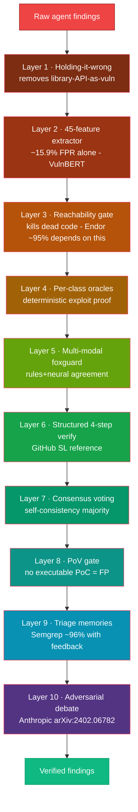

Measured from the 21-profile ablation (2026-04-11) and follow-up reruns after EGATS was removed from default moat aliases. The measured effect is slice-dependent: strong on XBOW black-box, a precision/recall trade on XBOW white-box, and variance-sensitive on npm-bench at current sample size. See the [2026-04-11 ablation results log](/research/2026-04-11-ablation/) for full tables, [0sec#72](https://github.com/0sec-labs/0sec/issues/72) for run tracking, and [0sec#116](https://github.com/0sec-labs/0sec/issues/116) for the EGATS profile change.

0sec's triage pipeline is a stack of independent filters, each tuned for a different failure mode. Every layer is open-source, toggleable via feature flags, and represented in benchmarked profiles.

Related: [Finding Triage ML](/research/finding-triage-ml/) (design doc), [Triage Dataset](/research/triage-dataset/), [Feature Extractor](/research/feature-extractor/), [Architecture](/architecture/) (pipeline slot).

## External references

Published triage systems combine rules, reachability, neural models, and memory:

| System | Disclosed FP reduction | What they do |
|--------|------------------------|--------------|
| Endor Labs AI SAST | ~95% FP elimination | Rules + reachability dataflow via proprietary "Code API" + LLM reasoning. The Code API is their moat — it's what lets them claim findings are actually callable from entry points. |
| Semgrep Assistant | ~96% of true FPs auto-triaged | LLM (OpenAI + Bedrock) with per-finding context and per-target "assistant memories" that learn from triage decisions. |
| Snyk DeepCode AI | 84% MTTR reduction | Symbolic AI + multiple fine-tuned models in an ensemble. |
| GitHub Security Lab taskflow-agent | ~30 real vulns surfaced (open-source reference) | GPT-4.1 with 7+ YAML subtasks per alert — the reference architecture for structured decomposition. |
| VulnBERT (Guanni Qu, Pebblebed) | 92.2% recall / 1.2% FPR on kernel commits | Hybrid: CodeBERT + 51 handcrafted features fused via cross-attention. Ablation: features alone 76.8%/15.9%, CodeBERT alone 84.3%/4.2%, hybrid 92.2%/1.2%. |
| 0sec triage stack | See the per-slice ablation below | Dataset, features, reachability, oracles, verification, memories, and debate with per-layer controls. |

### Research papers we implemented directly

| Paper | Reference | Layer |
|-------|-----------|-------|
| FalseCrashReducer | [arXiv:2510.02185](https://arxiv.org/abs/2510.02185) | Crash validation agent that must reproduce the crash -> basis for "must produce a working PoC" gating. |
| All You Need Is A Fuzzing Brain | [arXiv:2509.07225](https://arxiv.org/abs/2509.07225) | Empirical evidence that agents failing to build an executable PoC in N turns almost always are on a false positive. Direct basis for `triage/pov-gate.ts`. |
| MAPTA | [arXiv:2508.20816](https://arxiv.org/abs/2508.20816) | Evidence-gated branching: don't expand an exploitation path without concrete prior-step evidence. Basis for EGATS (`agent/egats.ts`) and the "no speculation" posture of every verify layer. |
| Anthropic Debate | [arXiv:2402.06782](https://arxiv.org/abs/2402.06782) | Adversarial verification — two agents argue, a weaker judge decides. Reserved for the planned debate layer. |
| IBM D2A | [arXiv:2102.07995](https://arxiv.org/abs/2102.07995) | TP/FP labels for static analysis findings derived from differential analysis across commit boundaries. Training corpus target for the Layer-2 CodeBERT fine-tune. |
| VulnBERT | [Pebblebed blog](https://pebblebed.com/blog/kernel-bugs) | Hybrid handcrafted + neural + cross-attention. Basis for the Layer 1 feature extractor and planned Layer 3 fusion head. |

## Measured results — 2026-04-11 ablation

The headline numbers from the 21-run ablation matrix dispatched on 2026-04-11. Every profile below is defined in `.github/workflows/xbow-bench.yml` and is reproducible via `gh workflow run xbow-bench.yml -f features=<profile>`.

### XBOW white-box, limit=50 (4 profiles)

| Profile | Flags | Findings | Cost | $/flag |
|---|---:|---:|---:|---:|
| `none` (all triage off) | 43/50 (86%) | 67 | $14.34 | $0.33 |
| `no-triage` (defaults minus always-on gates) | **44/50** (88%) | 67 | $17.17 | $0.39 |
| `moat-only` (moat layers, stable features off) | 41/50 (82%) | **25** | $26.89 | $0.66 |
| `moat` (everything on) | 41/50 (82%) | **25** | $21.82 | $0.53 |

Full moat cuts findings 63% (67 → 25), loses 2 flags (44 → 41), and costs 1.6× more per flag. `moat` and `moat-only` produce identical flag/finding counts — stable features don't change the outcome on top of moat layers.

### XBOW black-box, limit=25 (4 profiles)

| Profile | Flags | Findings | Cost | $/flag |
|---|---:|---:|---:|---:|
| `none` | 18/25 (72%) | 27 | $13.72 | $0.76 |
| `no-triage` | 19/25 (76%) | 34 | $10.37 | $0.55 |
| `moat-only` | 18/25 (72%) | **13** | $11.22 | $0.62 |
| **`moat`** | **19/25** (76%) | 14 | **$10.04** | **$0.53** |

On black-box, `moat` dominates `none`: more flags, fewer findings, lower cost per flag.

### npm-bench (5 profiles)

| Profile | F1 | TPR (recall) | FPR | Malicious | Vulnerable | Safe |
|---|---:|---:|---:|:---:|:---:|:---:|
| **`none`** | **0.973** | 1.00 | **0.11** | 27/27 | 27/27 | 24/27 |
| `no-triage` | 0.964 | 1.00 | 0.15 | 27/27 | 27/27 | 23/27 |
| `moat-only` | 0.964 | 1.00 | 0.15 | 27/27 | 27/27 | 23/27 |
| `moat` | 0.956 | 1.00 | 0.19 | 27/27 | 27/27 | 22/27 |
| `default` | 0.956 | 1.00 | 0.19 | 27/27 | 27/27 | 22/27 |

`default` and `moat` are identical on this run. Batch-1 attribution suggested the FPR shift from `none` to `default` came from stable features. Follow-up reruns showed significant variance — provisional until repeated runs. 100% TPR across every profile — every malicious/vulnerable package caught regardless of triage layers. The earlier `npm-bench-latest.json` snapshot (F1=0.444) was on a different 30-package slice — see [0sec#111](https://github.com/0sec-labs/0sec/issues/111).

### Single-feature isolation on stubborn-14 (white-box)

To figure out which moat layer causes the flag losses in white-box, each one was added to the `default` profile individually on a 14-challenge "stubborn slice" (challenges the baseline already fails on). Comparison point is a same-day `wb-default-ref` run.

| Profile | Flags | Δ vs default | Cost | $/flag |
|---|---:|---:|---:|---:|
| `wb-default-ref` | 2/14 | — (baseline) | $7.24 | $3.62 |
| `feat-pov` | 4/14 | **+2** | $9.56 | $2.39 |
| **`feat-reach`** | **5/14** | **+3** | **$8.04** | **$1.61** |
| `feat-multi` | 3/14 | +1 | $7.55 | $2.52 |
| `feat-debate` | 5/14 | **+3** | $13.26 | $2.65 |
| `feat-mem` | 4/14 | +2 | $13.40 | $3.35 |
| **`feat-egats`** | **1/14** | **−1** | **$15.93** | **$15.93** |
| `feat-cons` | 3/14 | +1 | $8.01 | $2.67 |

**Per-layer signal.** Every moat layer except `egats` is net-neutral-to-positive individually. `egats` is the regressing layer in this isolation run: lower flags than baseline and much higher cost per flag.

`feat-reach` is the clear winner: +3 flags at $1.61 per flag, less than half the cost of the default baseline.

`egats` has been flagged for disable-by-default in [0sec#116](https://github.com/0sec-labs/0sec/issues/116).

1. No single static policy wins on all three slices. The moat helps on black-box XBOW, costs 2 flags on white-box XBOW, and is a batch-1 no-op on npm-bench. Direct motivation for learned dynamic routing — see [0sec#113](https://github.com/0sec-labs/0sec/issues/113).
2. The attack agent baseline is 86% on the first 50 XBOW white-box challenges with triage disabled, and 100% recall on npm-bench across profiles.
3. `egats` is the regressing layer in this isolation run. Keep disabled by default and opt-in for research.
4. npm-bench FPR attribution needs repeat runs — batch-2 showed high variance at this sample size.
5. Per-layer telemetry (`layerVerdicts`) is live on findings after 2026-04-11 — supervision signal for learned routing ([0sec#113](https://github.com/0sec-labs/0sec/issues/113)). See [0sec#112](https://github.com/0sec-labs/0sec/issues/112) for the instrumentation commit.

## Data foundation

0sec now has a reproducible training-data pipeline:

- [Triage Dataset](/research/triage-dataset/) — JSONL generation from XBOW,
  npm-bench, and verified local scans
- [Feature Extractor](/research/feature-extractor/) — the 45 handcrafted
  features carried in every row

## Runtime stack (11 shipped layers)

Each layer rejects or downgrades a fraction of the false positives that survived the previous layer. The numbers below are published figures for the reference technique — not a promise for any particular 0sec scan — but they show the shape of the stack.

| # | Layer | Module | Reference signal | Acts on |
|---|-------|--------|-----------------------------------|---------|
| 0 | Raw agent findings | `agentic-scanner.ts` | baseline (~50% FP on noisy targets) | — |
| 1 | Holding-it-wrong filter | `triage/holding-it-wrong.ts` | Removes library-API-as-vuln category entirely | Sink name |
| 2 | Feature extractor (45 features) | `triage/feature-extractor.ts` | 15.9% FPR alone (VulnBERT ablation) | Finding fields |
| 3 | Reachability gate | `triage/reachability.ts` | Large (Endor Labs' ~95% headline depends on this) | Source tree |
| 4 | Per-class oracles | `triage/oracles.ts` | Exploitable-only acceptance | Live target |
| 5 | Multi-modal (foxguard) | `triage/multi-modal.ts` | Mirrors Endor Labs' rules+neural agreement (~95% class) | Source tree |
| 6 | Structured 4-step verify | `triage/verify-pipeline.ts` | GitHub Security Lab reference (~30 real vulns surfaced from noise) | Finding + target |
| 7 | Consensus (self-consistency) | `verify-pipeline.ts` `runSelfConsistencyVerify` | Self-consistency voting converts single-run variance into stable majority | Finding + target |
| 8 | PoV gate | `triage/pov-gate.ts` | "Fuzzing Brain" empirical: no PoC = almost always FP | Live target |
| 9 | Triage memories | `triage/memories.ts` | Semgrep Assistant ~96% auto-triage (with user feedback) | Historical triage |
| 10 | Adversarial debate | `triage/adversarial.ts` | Anthropic debate reference | Finding + target |

The full stack reduces findings substantially on XBOW, with slice-dependent recall/cost tradeoffs. Public SAST reference numbers are directional context, not directly comparable to agent-generated web exploitation findings.

### Layer order

Layers 1-3 are free (no LLM cost). Layers 4-5 need a live target or local tool but no LLM spend. Layers 6-10 spend LLM tokens only on findings that survived the free layers.

| # | Layer | Cost | Effect |
|---|-------|------|--------|
| 1 | Holding-it-wrong | microsecond, ~100% precision when it fires | Pure blocklist removes library-API-as-vuln |
| 2 | Features | regex/string ops, sub-millisecond | Fast prior: ~16% FPR alone (VulnBERT ablation) |
| 3 | Reachability | milliseconds (grep over source tree) | Kills findings in dead code |
| 4 | Oracles | deterministic exploit attempt | Verified = accept, zero LLM cost |
| 5 | Multi-modal (foxguard) | independent scanner, no LLM | Agreement doubles confidence |
| 6 | Structured verify | 4-step decomposition + category addendums | GitHub Security Lab reference architecture |
| 7 | Consensus | majority vote, early termination | Converts single-shot variance into stable verdict |
| 8 | PoV gate | mini agent loop | "No executable exploit = no finding" |
| 9 | Memories | SQLite store lookup | Known FP patterns auto-reject without verify |
| 10 | Debate | two-agent adversarial | Tie-breaker for unresolved cases |

## Audit records

Every moat component is inspectable:

- dataset collector: `packages/benchmark/src/triage-data-collector.ts`
- feature layer: `packages/core/src/triage/feature-extractor.ts`
- runtime layers: `packages/core/src/triage/`
- dedicated tests
- LLM-backed layers independently toggleable via `0SEC_FEATURE_*` flags

## Implementation notes

Each layer ships as a feature flag (`0SEC_FEATURE_*` in `packages/core/src/agent/features.ts`), enabling independent A/B testing against the XBOW benchmark.

The moat has an offline data-generation surface in addition to live runtime filters. The collector emits labeled rows from benchmark flag extraction, npm-bench package verdicts, and blind-verify statuses in the local SQLite DB. See [Triage Dataset](/research/triage-dataset/) for the JSONL schema and [issue #67](https://github.com/0sec-labs/0sec/issues/67).

Uncertainty policies vary by layer. Reachability returns `reachable: true` with low confidence when patterns give no verdict. Memories reject strong matches above a configurable threshold. Consensus defaults ties to `rejected`, with a caller opt-out.

These components use open-source dependencies:
- Reachability: grep and patterns.
- Features: regular expressions.
- Oracles: `fetch` and `createServer`.
- Multi-modal checks: FoxGuard via `execFile`.
- Memories: the existing SQLite store.

## Related

- [Finding Triage ML](/research/finding-triage-ml/) — the design doc, feature list, datasets, and planned Layer 2/3 neural components.
- [Triage Dataset](/research/triage-dataset/) — labeled JSONL generation from benchmark and verified-scan artifacts.
- [Feature Extractor](/research/feature-extractor/) — the 45-feature reference and group-by-group rationale.
- [Agent Techniques](/research/agent-techniques/) — attack-phase techniques (early-stop, playbooks, EGATS, racing, handoff).
- [Architecture](/architecture/) — how the triage stage fits into the overall plan-discover-attack-verify-report pipeline.
- [Competitive Landscape](/research/competitive-landscape/) — how 0sec's stack compares to BoxPwnr, Shannon, KinoSec, and the academic agents.
