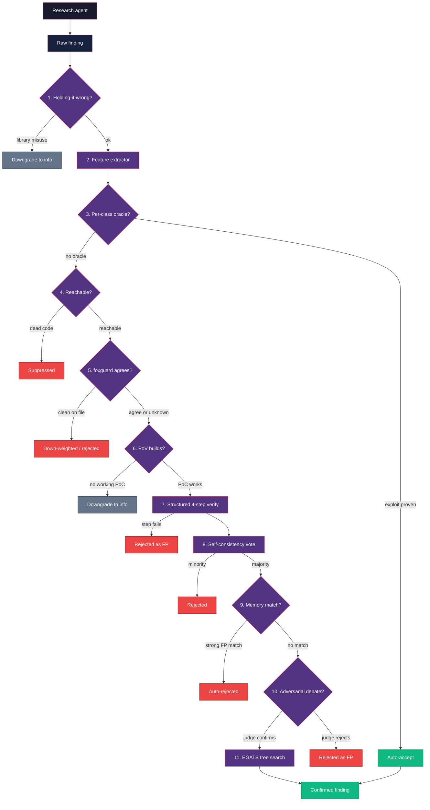

Autonomous pentesters are only as valuable as their false-positive rate.
pwnkit ships a triage pipeline between the research agent and the blind
verify agent. Every finding walks through a stack of independent
filters, each of which can kill, downgrade, or boost it. Most filters are
deterministic, zero-cost, and run before any LLM verification token is
spent.

> **Status (2026-04-11):** The effect of this pipeline has now been
> measured end-to-end. See the [FP Reduction Moat](/research/fp-reduction-moat/)
> page for the numbers and [the 2026-04-11 ablation results log](/research/2026-04-11-ablation/)
> for the narrative. Short version: the stack strictly dominates the
> no-triage baseline on XBOW black-box, is a Pareto tradeoff on XBOW
> white-box (costs 2 flags at limit=50 for 63% fewer findings), and is
> a no-op on npm-bench. Layer 11 (EGATS) is the one broken layer and
> is opt-in only — see pwnkit#116.

## Pipeline overview



Each stage is independently configurable via environment variables and
surfaced through `packages/core/src/triage/`.

## 1. Holding-it-wrong filter

**Module:** `triage/holding-it-wrong.ts` (always on)

Kills findings where the "vulnerability" is literally the documented
behavior of the sink. Classic examples: reporting `fs.writeFile` as an
arbitrary-file-write vuln, `vm.compileFunction` as code execution, or
`toFunction(cb)` as callback injection. The filter downgrades the
finding to `info` and skips downstream verification.

## 2. 45-feature extractor

**Module:** `triage/feature-extractor.ts` (always available)

Extracts a 45-element numeric vector per finding: response shape
(status, size, reflection, error markers), payload signals (encoding,
sink class, parameter location), and category priors. Inspired by
VulnBERT's hybrid architecture — handcrafted features alone achieve
~77% recall / 16% FPR, and the same vector fuses cleanly with neural
embeddings for downstream ML.

See `FEATURE_NAMES` in the module for the full ordered feature list.

For a complete reference, use [Feature Extractor](/research/feature-extractor/).
For the labeled JSONL pipeline that carries this vector into model training,
use [Triage Dataset](/research/triage-dataset/).

## 3. Per-class oracles

**Module:** `triage/oracles.ts` (always on for supported categories)

Deterministic, category-specific verification oracles. No exploit, no
report.

| Category | Oracle | Proof |
|----------|--------|-------|
| SQLi | `verifySqli` | SQL error signatures + timing delta under sleep payloads |
| Reflected XSS | `verifyReflectedXss` | Unique token reflected in an executable context |
| SSRF | `verifySsrf` | Out-of-band callback (spins a local listener on demand) |
| RCE | `verifyRce` | Command output round-trip through the response |
| Path traversal | `verifyPathTraversal` | `/etc/passwd` signature (or Windows equivalent) |
| IDOR | `verifyIdor` | Differential response across identities |

Call `verifyOracleByCategory(finding, target)` to dispatch by category.

## 4. Reachability gate

**Module:** `triage/reachability.ts`
**Flag:** `PWNKIT_FEATURE_REACHABILITY_GATE=1`

When a source tree is available, walks imports, route mounts, and
framework entry points to check whether the vulnerable sink is
actually reachable from an HTTP handler, CLI main, or user-facing API.
Dead code and test-only paths are suppressed before we spend LLM
tokens verifying them.

This is a zero-dependency grep/pattern pass today and is deliberately
conservative: when it cannot make a confident call it returns
`reachable: true` with low confidence so later stages still get a
chance. A tree-sitter-based interprocedural upgrade is planned.

## 5. Multi-modal agreement (foxguard × pwnkit)

**Module:** `triage/multi-modal.ts`
**Flag:** `PWNKIT_FEATURE_MULTIMODAL=1`

When both a source tree and the [foxguard](https://github.com/0sec-labs/foxguard)
binary are available, pwnkit runs foxguard against the same code and
cross-checks every finding against foxguard's SARIF output.

- **Both scanners fire on the same file / category** → auto-accepted
  with high confidence.
- **Only pwnkit fires, foxguard scanned the file cleanly** →
  down-weighted or auto-rejected.
- **foxguard didn't scan the file** → no signal either way.

```bash
export PWNKIT_FEATURE_MULTIMODAL=1
pwnkit scan --target https://example.com --repo ./source
```

This is the opensoar-hq trinity validation pattern: pwnkit detects,
foxguard cross-checks, opensoar responds.

## 6. PoV generation gate

**Module:** `triage/pov-gate.ts`
**Flag:** `PWNKIT_FEATURE_POV_GATE=1`

Backed by the empirical ground truth from *All You Need Is A Fuzzing
Brain* (arXiv:2509.07225): if an agent can't build a working PoC in N
turns, the finding is almost certainly a false positive.

Spins up a narrowly-scoped mini agent loop whose only job is to
produce a concrete, executable exploit that demonstrably works. No
speculation, no "would-be" payloads — the exploit must run and the
response must contain category-specific proof of exploitation.

- `hasPov: true` → boost confidence, attach the artifact to
  `finding.evidence`.
- `hasPov: false` → downgrade severity to `info` and set
  `triageNote = "no_pov"`.

## 7. Structured 4-step verify pipeline

**Module:** `triage/verify-pipeline.ts` (default when a runtime is available)

Inspired by GitHub Security Lab's taskflow-agent approach, the single-shot
blind verify is decomposed into four focused subtasks, each with domain-
specific prompts and category-specific addendums:

1. **Reachability analysis** — can the vuln be triggered from external
   input?
2. **Payload validation** — does the PoC actually demonstrate the claim?
3. **Impact assessment** — what is the real-world security impact?
4. **Exploit confirmation** — independently reproduce with only the PoC
   and the target path.

Any step failure marks the finding as a false positive.

## 8. Self-consistency voting

**Flag:** `PWNKIT_FEATURE_CONSENSUS_VERIFY=1`

Runs the structured verify pipeline N times (different sampling seeds)
and takes the majority vote. Trades tokens for confidence — useful on
ambiguous findings where a single verify pass is noisy.

## 9. Assistant memories

**Module:** `triage/memories.ts`
**CLI:** `pwnkit-cli triage ...`
**Flag:** `PWNKIT_FEATURE_TRIAGE_MEMORIES=1`

Semgrep-style per-target persistent FP context that learns from human
triage decisions. When a user marks a finding as a false positive (and
says why), the reason is stored as a `TriageMemory`. On future scans
the memories are injected as few-shot examples into the verify prompt,
and a sufficiently strong match auto-rejects the finding without
spending a verify call.

Scope hierarchy:

- `global` — applies to every scan.
- `package` — applies to findings whose target starts with a given
  package identifier (npm name, repo prefix).
- `target` — applies only to an exact target URL or path.

Relevance is currently a lightweight token-overlap heuristic; an
embedding-backed ranker can replace `scoreMemory` without touching the
public API.

### `pwnkit-cli triage` commands

```bash
# Mark a finding as a false positive and remember why
pwnkit-cli triage mark-fp <finding-id> --reason "test fixture, not prod"

# Add a standalone memory (without a backing finding)
pwnkit-cli triage memory add --finding <id> --reason "sink is harmless helper" \
  --scope package --scope-value my-pkg

# List memories
pwnkit-cli triage memory list --scope target
```

## 10. Adversarial debate

**Module:** `triage/adversarial.ts`
**Flag:** `PWNKIT_FEATURE_DEBATE=1`

Two fresh-context agents argue opposing positions — a prosecutor makes the
case that the finding is real, a defender makes the case that it is a
false positive — and a third, deliberately skeptical judge picks the
winner. Each agent sees only the other side's written arguments, never
the original research agent's chain of thought.

This is the open-source implementation of Anthropic's debate paper
(arXiv:2402.06782). The point is error decorrelation: single-pass verify
shares priors with the discovery agent (same model, same prompt family),
so their mistakes line up. Adversarial agents with opposing instructions
have uncorrelated error modes and catch cases that a single verifier
misses.

## 11. EGATS — Evidence-Gated Attack Tree Search

**Flag:** `--egats` or `PWNKIT_FEATURE_EGATS=1`

Beam-search over an explicit hypothesis tree. The agent proposes attack
branches, each with required evidence, and only expands branches where
prior evidence is observed. Dead hypotheses are pruned aggressively,
which keeps the budget focused on exploitable paths.

EGATS is the highest-variance stage in the pipeline — use it when you
need breadth (e.g. unknown-class vulnerabilities) rather than depth on
a known lead.

## Configuration cheat-sheet

| Env var | Default | Stage |
|---------|---------|-------|
| `PWNKIT_FEATURE_HOLDING_IT_WRONG` | **on** | 1 |
| `PWNKIT_FEATURE_EVIDENCE_GATE` | **on** | 2 |
| `PWNKIT_FEATURE_REACHABILITY_GATE` | off | 4 |
| `PWNKIT_FEATURE_MULTIMODAL` | off | 5 |
| `PWNKIT_FEATURE_POV_GATE` | off | 6 |
| `PWNKIT_FEATURE_PUBLISHABILITY_GATE` | off | 6 |
| `PWNKIT_FEATURE_POC_GEN_STATIC` | off | 6 |
| `PWNKIT_FEATURE_CONSENSUS_VERIFY` | off | 8 |
| `PWNKIT_FEATURE_LEARNED_ROUTER` | off | router |
| `PWNKIT_FEATURE_DYNAMIC_TRIAGE` | off | router |

`PWNKIT_FEATURE_TRIAGE_MEMORIES`, `PWNKIT_FEATURE_DEBATE`, and
`PWNKIT_FEATURE_EGATS` appeared in earlier versions of this table but no
longer exist in the codebase — `egats` was removed from the default
aliases after the ablation measured it regressing the hardest slice
([pwnkit#116](https://github.com/0sec-labs/pwnkit/issues/116)). Sections
9-11 above describe layers that are no longer separately toggleable.

See [Features](/features/) for the complete env-var inventory.

## Enabling the whole moat at once

Turning the moat on is a measurement, not an upgrade. The
[2026-04-11 ablation](/research/2026-04-11-ablation/) found its effect is
slice-dependent: a strict win on XBOW black-box, a 0-2 flag cost on
white-box (inside run noise after the broken `egats` layer was removed),
and a no-op on npm-bench. The large number people remember — roughly 60%
fewer findings — is the moat working as intended; the flag count, which
is the ground-truth-correct outcome, stayed roughly flat. Enable it to
re-measure, not because it is expected to score better.

Every gate above is off by default, so measuring what the moat is worth
means setting six variables and getting all six right. `fp-moat` is a
preset that names the set:

```bash
pwnkit scan --features fp-moat --target https://example.com
# or, for CI where the command line is templated:
PWNKIT_FEATURE_PRESET=fp-moat pwnkit scan --target https://example.com
```

It expands to `PWNKIT_FEATURE_REACHABILITY_GATE`, `_MULTIMODAL`,
`_PUBLISHABILITY_GATE`, `_POV_GATE`, `_POC_GEN_STATIC`, and
`_CONSENSUS_VERIFY`. The membership lives in
`packages/core/src/agent/feature-presets.ts` and is pinned by test.

A flag you set yourself always wins, so you can ablate one layer out of
an otherwise-full moat:

```bash
PWNKIT_FEATURE_POV_GATE=0 pwnkit scan --features fp-moat …
```

The preset deliberately leaves out `PWNKIT_FEATURE_LEARNED_ROUTER` and
`PWNKIT_FEATURE_DYNAMIC_TRIAGE`. Those decide which layers to *skip* per
finding, so enabling them alongside the moat would let the router
suppress the layers you are trying to measure.

## Checking which layers actually ran

Turning layers on is only half of a defensible claim. Each layer records
a verdict on the finding as it executes, and `findings show` renders that
record:

```bash
pwnkit findings show <id>
```

```
  Triage provenance:
  FP moat NOT engaged: no opt-in moat layer ran for this finding (always-on filters only)
  Layers: 3 executed, 5 skipped, 3 unrecorded | 412ms | $0.0000
    + holding_it_wrong   executed(pass) — no holding-it-wrong pattern matched
    + evidence_gate      executed(pass) — evidence_completeness=0.83 > 0.5
    - reachability       skipped(skip) — PWNKIT_FEATURE_REACHABILITY_GATE=0
    …
```

Three things worth knowing about how to read this:

- It is derived from the verdicts stored **on the finding**, never from
  your current environment. A finding produced by a default scan still
  reports the moat as not engaged even if you have every flag exported in
  your shell — otherwise re-reading an old finding could silently
  overstate what it went through.
- `skipped` and `unrecorded` are different. `skipped` means the layer
  recorded that it stood down, and the reason names the flag or the
  missing precondition. `unrecorded` means no verdict exists at all.
- Three layers are permanently `unrecorded`: `structured_verify`,
  `consensus`, and `kernel_oracle` emit no verdict anywhere in the
  engine, so their execution cannot be observed today. They are listed in
  `UNINSTRUMENTED_LAYERS` and reported with an explicit
  "no instrumentation" reason rather than being quietly counted as
  skipped. Until that changes, they cannot back an FP-moat claim.

## Further reading

- [Agent Loop](/agent-loop/) — how the research agent drives `bash`
- [Blind Verification](/blind-verification/) — how step 7 isolates the
  verify agent from the research agent's reasoning
- [Research: Finding Triage ML](/research/finding-triage-ml/) — the
  longer-form synthesis behind this pipeline
